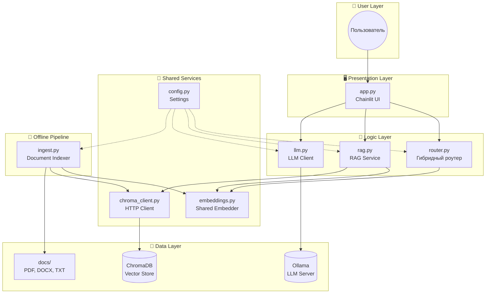
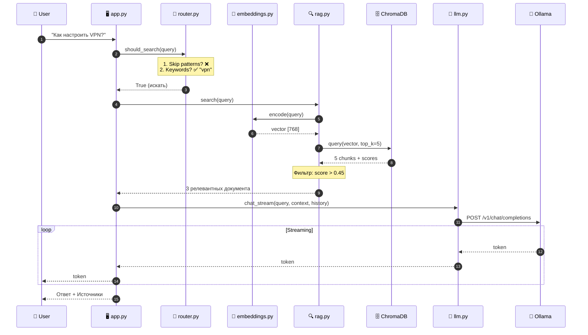
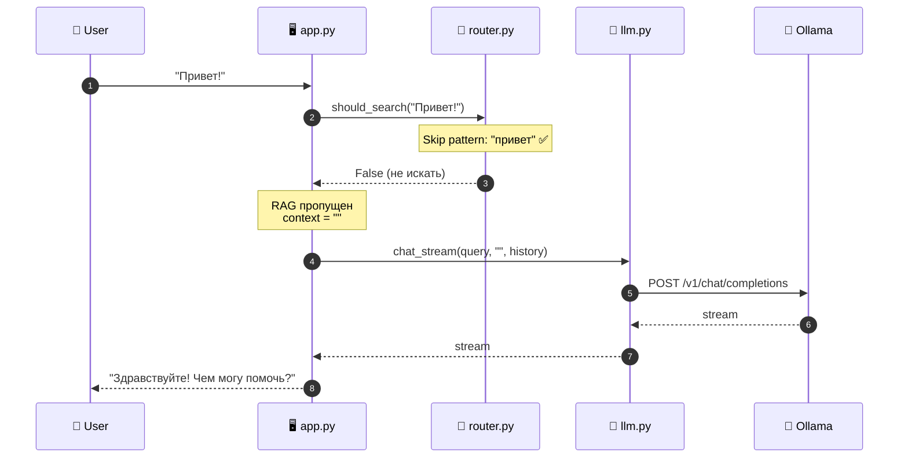
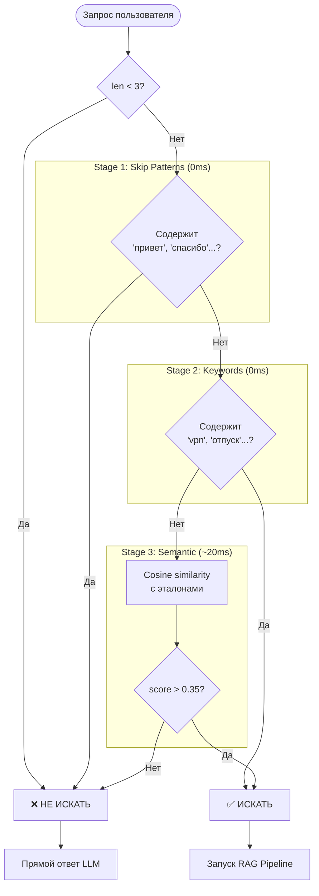
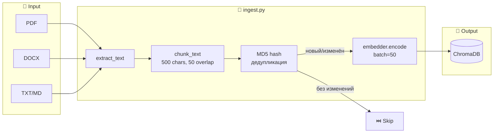
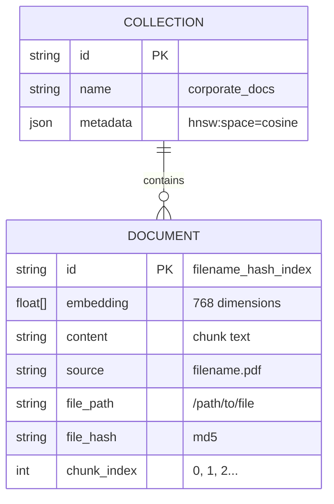
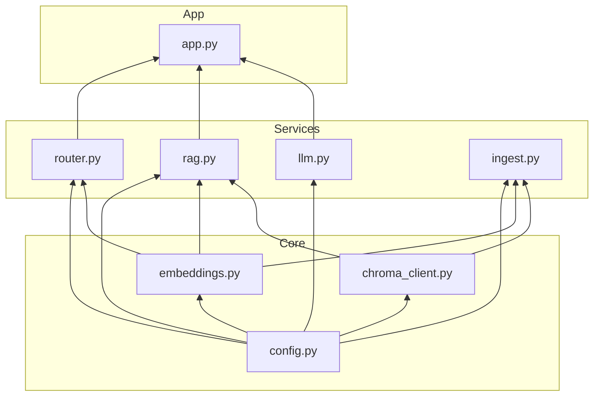

# Архитектура RAG-системы

## Общая схема компонентов



## Поток обработки запроса (Request Flow)



## Fast Flow (без RAG)



## Логика роутера (3-Stage Decision)



## Pipeline индексации документов



## Структура данных в ChromaDB



## Зависимости между модулями



## Порты и сервисы

| Сервис | Порт | Назначение |
|--------|------|------------|
| Chainlit | 8000 | Web UI |
| ChromaDB | 8001 | Vector Database |
| Ollama | 11434 | LLM Inference |

## Переменные окружения (.env)

```
CHROMA_HOST=localhost
CHROMA_PORT=8001
LLM_BASE_URL=http://localhost:11434/v1
LLM_MODEL=qwen2.5:7b
```
